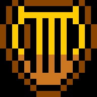
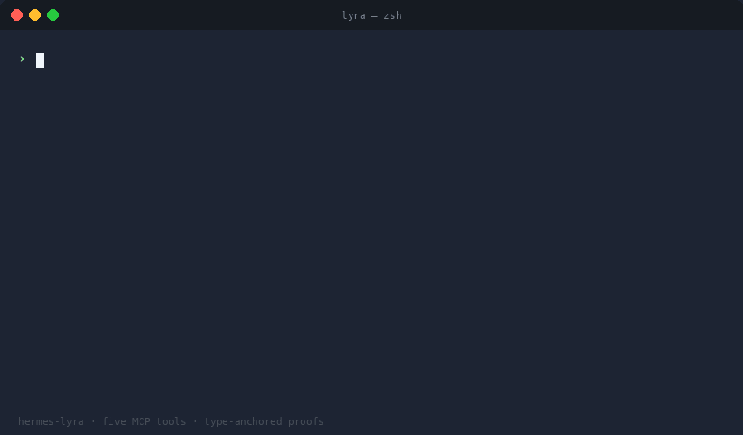

<a id="readme-top"></a>

<!-- PROJECT SHIELDS -->
[![Stargazers][stars-shield]][stars-url]
[![Issues][issues-shield]][issues-url]
[![MIT][license-shield]][license-url]
[![Rust][rust-shield]][rust-url]
[![Tests][tests-shield]](#self-verify)


<!-- PROJECT LOGO -->
<br />
<div align="center">
  <a href="https://github.com/ZiriaLabs/hermes-lyra">
    
  </a>

  <h3 align="center">hermes-lyra</h3>

  <p align="center">
    Typed, self-verifying skill contracts over MCP.
    <br />
    <a href="docs/specification.md"><strong>Read the spec »</strong></a>
    <br />
    <br />
    <a href="examples/">Examples</a>
    &middot;
    <a href="https://github.com/ZiriaLabs/hermes-lyra/issues/new?labels=bug">Report Bug</a>
    &middot;
    <a href="https://github.com/ZiriaLabs/hermes-lyra/issues/new?labels=enhancement">Request Feature</a>
  </p>
</div>


<!-- TABLE OF CONTENTS -->
<details>
  <summary>Table of Contents</summary>
  <ol>
    <li>
      <a href="#about-the-project">About The Project</a>
      <ul>
        <li><a href="#the-five-tools">The Five Tools</a></li>
        <li><a href="#built-with">Built With</a></li>
      </ul>
    </li>
    <li>
      <a href="#getting-started">Getting Started</a>
      <ul>
        <li><a href="#prerequisites">Prerequisites</a></li>
        <li><a href="#installation">Installation</a></li>
        <li><a href="#build-from-source">Build From Source</a></li>
      </ul>
    </li>
    <li>
      <a href="#usage">Usage</a>
      <ul>
        <li><a href="#skillmd-format">SKILL.md Format</a></li>
        <li><a href="#effects-vocabulary">Effects Vocabulary</a></li>
        <li><a href="#cli-reference">CLI Reference</a></li>
        <li><a href="#self-verify">Self-Verify</a></li>
      </ul>
    </li>
    <li><a href="#roadmap">Roadmap</a></li>
    <li><a href="#contributing">Contributing</a></li>
    <li><a href="#license">License</a></li>
    <li><a href="#acknowledgments">Acknowledgments</a></li>
  </ol>
</details>


<!-- ABOUT THE PROJECT -->
## About The Project

<div align="center">
  
</div>

`hermes-lyra` gives any `SKILL.md` three things its prose alone can't carry:

* A **typed contract** for inputs, outputs, effects, and references — embedded as YAML frontmatter.
* A **self-verifying proof** (BLAKE3 `output_hash`) anyone can replay offline. Same input + same substrate → same bytes, on every machine.
* **Five MCP tools** that gate skill mutation, composition, and lineage.

Protocol identifier: `hermes-lyra/0.2`. Runtime ident: `hermes-lyra/<crate>+uor-foundation/<substrate>`. Type-anchored to [`uor-foundation`](https://crates.io/crates/uor-foundation) via `ConstrainedTypeShape` — proofs are computed by the substrate, not a hand-written hash function.

<p align="right">(<a href="#readme-top">back to top</a>)</p>

### The Five Tools

The entire agent-facing surface. Each tool accepts a SKILL.md or a descriptor JSON; the bridge auto-detects.

| MCP tool         | What it does                                                                                                          | Returns                                                                  |
|------------------|-----------------------------------------------------------------------------------------------------------------------|--------------------------------------------------------------------------|
| `skill_bind`     | Embed a typed contract + proof into a SKILL.md's frontmatter. Upgrades existing files; scaffolds new ones. Idempotent. | `{status: "certified", skill_md, proof}`                                 |
| `skill_verify`   | Re-derive the embedded proof. Local, no network.                                                                       | `{status: "valid" \| "mismatch" \| "no_proof", descriptor?}`             |
| `skill_refine`   | R1–R5 refinement check: name unchanged, version increased, input widens, output narrows, effects ⊆ parent.             | `{status: "promote", lineage_receipt}` or `{status: "rollback", rule_fired, reason}` |
| `skill_compose`  | Composition check: producer's `output_shape` must flow into consumer's `input_shape`. Pair or N-skill chain.            | `{status: "compatible"}` or `{status: "incompatible", at_step, reason}` |
| `skill_merge`    | Atomic merge of producer + consumer into one self-contained SKILL.md.                                                  | `{status: "fused", skill_md, descriptor_json, proof, effects_union}`     |

CLI equivalents: `lyra bind`, `lyra verify`, `lyra refine`, `lyra compose`, `lyra merge`. Exit codes: `0` safe, `1` rejected, `2` I/O / argument error.

<p align="right">(<a href="#readme-top">back to top</a>)</p>

### Built With

* [![Rust][rust-badge]][rust-url]
* [![uor-foundation][uor-badge]][uor-url] — sealed-type substrate
* [![BLAKE3][blake3-badge]][blake3-url] — content hash
* [![MCP][mcp-badge]][mcp-url] — wire protocol

No `serde`, no `tokio`, no MCP SDK. JSON parser, base64 codec, JSON-RPC envelope, demo, and acceptance suite are all hand-rolled in this crate.

<p align="right">(<a href="#readme-top">back to top</a>)</p>


<!-- GETTING STARTED -->
## Getting Started

### Prerequisites

* Rust 1.83 or newer (2021 edition)
  ```sh
  rustup update stable
  ```
* An MCP-capable agent runtime (e.g. `~/.hermes/`) for the one-line install.

### Installation

```bash
cargo install --locked --git https://github.com/ZiriaLabs/hermes-lyra
lyra install
```

`lyra install` registers the server in `~/.hermes/config.yaml` (`$HERMES_HOME/config.yaml` if set), pointing `mcp_servers.lyra` at the binary you just installed. Idempotent. Atomic. The config is auto-reloaded on the next save tick — no restart. Remove with `lyra install --uninstall`.

For any other MCP client (Claude Desktop, Cursor, …) mount the canonical [`mcp.json`](mcp.json):

```json
{ "mcpServers": { "lyra": { "command": "lyra", "args": ["mcp", "serve"] } } }
```

Speaks newline-delimited JSON-RPC 2.0 over stdio, MCP version `2025-06-18` (negotiation back-compat to `2025-03-26` and `2024-11-05`).

### Build From Source

```sh
git clone https://github.com/ZiriaLabs/hermes-lyra
cd hermes-lyra
cargo build --release
cargo test --release         # 215 PASS
./target/release/lyra self-check
```

Three runtime dependencies: `uor-foundation` (substrate), `uor-foundation-sdk` (sealed-type macros), `blake3` (hash). Everything else is in this crate.

<p align="right">(<a href="#readme-top">back to top</a>)</p>


<!-- USAGE -->
## Usage

### SKILL.md Format

A skill carries its contract and proof as YAML frontmatter — the same place its `name`, `description`, and `version` already live:

```text
---
name: inbox-triage
description: Summarize a batch of emails into a fixed, typed brief.
license: MIT
version: "0.1.0"
contract: {"content_hash":"...","effects":["llm"],"input_shape":{...},
           "name":"inbox-triage","output_shape":{...},"references":[],
           "version":"0.1.0"}
proof:    {"protocol":"hermes-lyra/0.2","spec_uri":"https://github.com/ZiriaLabs/hermes-lyra",
           "output_hash":"...","runtime":"hermes-lyra/0.2.0+uor-foundation/0.4.2"}
---

# inbox-triage
Prose readers see as before.
```

Standard YAML, standard markdown. Inline JSON values keep the parser zero-dependency. Anything that doesn't care about `contract:` / `proof:` ignores them.

### Effects Vocabulary

A closed set:

```
none          file_read       file_write
web_read      web_write       terminal       llm
```

R5 of refinement (`effects ⊆ parent.effects`) catches the GEPA-style failure mode where a mutated skill quietly starts using a new toolset.

### CLI Reference

```sh
lyra bind     <SKILL.md> <descriptor.json>     # embed contract + proof
lyra bind     <descriptor.json>                # scaffold a fresh SKILL.md
lyra verify   <SKILL.md>                       # re-derive embedded proof
lyra refine   <parent> <child>                 # R1–R5 refinement check
lyra compose  <s1> <s2> [<s3> ...]             # composition check
lyra merge    <producer> <consumer>            # atomic merge

lyra install [--uninstall]                     # register in ~/.hermes/config.yaml
lyra mcp serve                                 # MCP server over stdio
lyra demo refine                               # walk a refinement scenario
lyra self-check                                # acceptance suite
```

### Self-Verify

```text
$ lyra self-check
lyra self-check (runtime: hermes-lyra/0.2.0+uor-foundation/0.4.2)
--------------------------------------------------------
  PASS  inbox-triage      / skill_interface_hash
  PASS  news-brief        / skill_interface_hash
  PASS  code-review v0.1.0/ skill_interface_hash
  PASS  code-review v0.1.1/ skill_interface_hash
  PASS  lineage v0.1.0->v0.1.1 / next_generation
  PASS  v0.2.0-bad rejected with OutputWidened (tripwire live)
  PASS  receipt JSON roundtrip
--------------------------------------------------------
self-check: 7/7 PASS
```

If your binary disagrees with anyone else's on a single byte, `self-check` says so.

_For the formal protocol definition, see [`docs/specification.md`](docs/specification.md)._

<p align="right">(<a href="#readme-top">back to top</a>)</p>


<!-- ROADMAP -->
## Roadmap

- [x] v0.2 — frontmatter-only SKILL.md format, five `skill_*` MCP tools, type-anchored substrate
- [x] One-line install (`lyra install`) with atomic config splice
- [x] 215-test acceptance suite, decentralized `self-check`
- [ ] Publish `lyra-ref` to crates.io once a stable release is cut
- [ ] Fix `inputSchema` mismatch on `skill_bind` (`descriptor` arg is declared `string` but parser expects an inline JSON object)
- [ ] Expand example pack with multi-stage compose chains (≥3 producers)
- [ ] Tighten `proof.spec_uri` semantics — currently informational, may be folded into canonical bytes in a future major

See the [open issues](https://github.com/ZiriaLabs/hermes-lyra/issues) for the full list.

<p align="right">(<a href="#readme-top">back to top</a>)</p>


<!-- CONTRIBUTING -->
## Contributing

Contributions are welcome. The bar is high: every new field, effect, or shape adds complexity that every implementer must support. **When in doubt, leave it out.**

1. Fork the project
2. Create your feature branch (`git checkout -b feature/AmazingFeature`)
3. Run `cargo test --release` — all 278 tests must pass
4. Run `cargo fmt --all` and `cargo clippy --workspace -- -D warnings`
5. Open a pull request

Architectural changes belong in an Issue first. Any change to canonical bytes, the protocol identifier, or field semantics requires a protocol version bump.


<p align="right">(<a href="#readme-top">back to top</a>)</p>


<!-- LICENSE -->
## License

Distributed under the MIT License. See [`LICENSE`](LICENSE) for details.

<p align="right">(<a href="#readme-top">back to top</a>)</p>


<!-- ACKNOWLEDGMENTS -->
## Acknowledgments

* [UOR Foundation](https://github.com/UOR-Foundation/UOR-Framework) — the sealed-type substrate (`uor-foundation`, `uor-foundation-sdk`) that anchors every proof
* [BLAKE3](https://github.com/BLAKE3-team/BLAKE3) — the content hash
* [Model Context Protocol](https://modelcontextprotocol.io) — the wire format
* [Best-README-Template](https://github.com/othneildrew/Best-README-Template) — the structure of this document

<p align="right">(<a href="#readme-top">back to top</a>)</p>


<!-- MARKDOWN LINKS & IMAGES -->
[stars-shield]:    https://img.shields.io/github/stars/ZiriaLabs/hermes-lyra.svg?style=for-the-badge
[stars-url]:       https://github.com/ZiriaLabs/hermes-lyra/stargazers
[issues-shield]:   https://img.shields.io/github/issues/ZiriaLabs/hermes-lyra.svg?style=for-the-badge
[issues-url]:      https://github.com/ZiriaLabs/hermes-lyra/issues
[license-shield]:  https://img.shields.io/github/license/ZiriaLabs/hermes-lyra.svg?style=for-the-badge
[license-url]:     https://github.com/ZiriaLabs/hermes-lyra/blob/main/LICENSE
[rust-shield]:     https://img.shields.io/badge/Rust-1.83%2B-orange?style=for-the-badge&logo=rust&logoColor=white
[tests-shield]:    https://img.shields.io/badge/tests-215%20passing-success?style=for-the-badge

[rust-badge]:      https://img.shields.io/badge/Rust-000000?style=for-the-badge&logo=rust&logoColor=white
[rust-url]:        https://www.rust-lang.org/
[uor-badge]:       https://img.shields.io/badge/uor--foundation-0.4.2-1f6feb?style=for-the-badge
[uor-url]:         https://crates.io/crates/uor-foundation
[blake3-badge]:    https://img.shields.io/badge/BLAKE3-000000?style=for-the-badge
[blake3-url]:      https://github.com/BLAKE3-team/BLAKE3
[mcp-badge]:       https://img.shields.io/badge/MCP-2025--06--18-1f6feb?style=for-the-badge
[mcp-url]:         https://modelcontextprotocol.io
